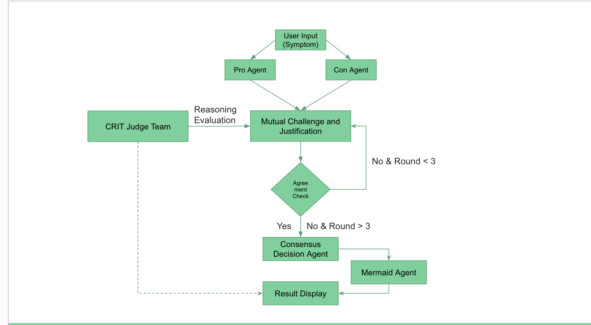
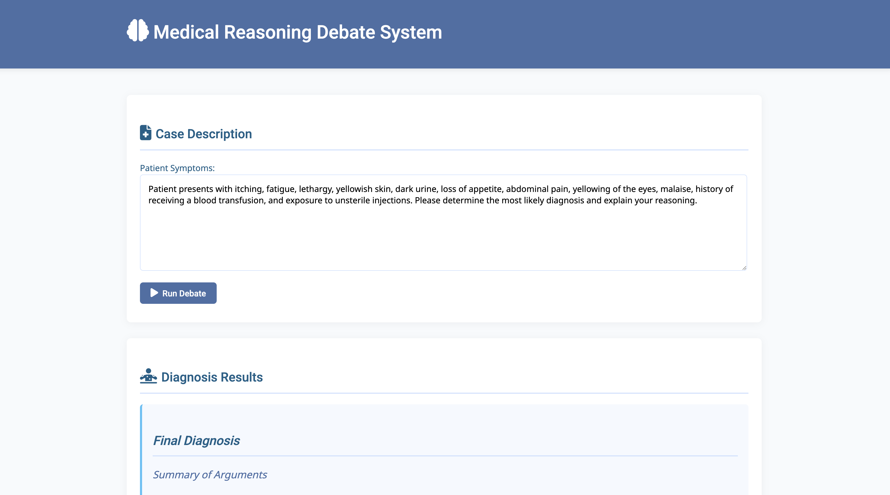
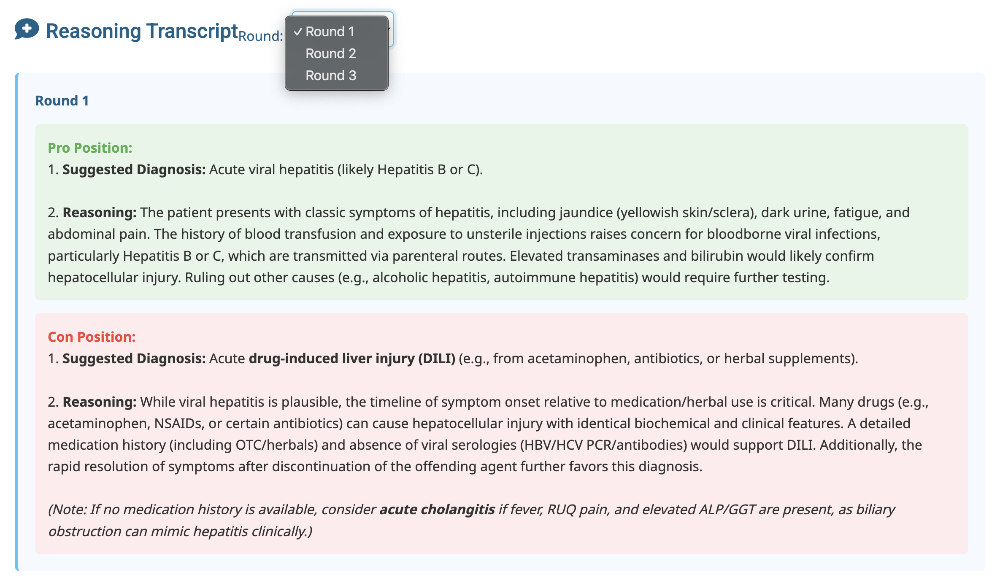
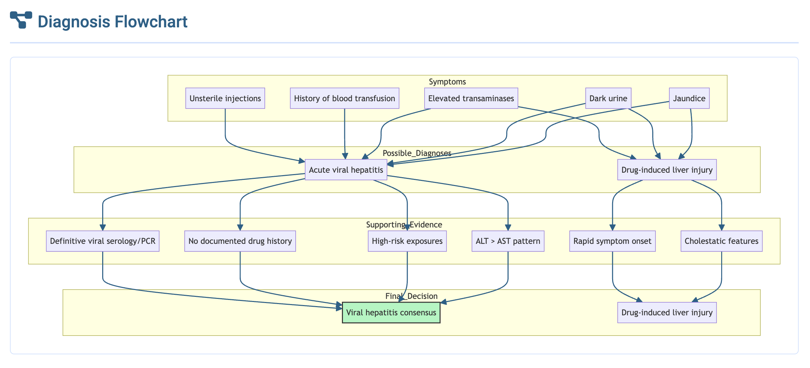

# 🧠 Multi-Agent Diagnose System

A clinical reasoning framework using **multi-agent debate among large language models (LLMs)** to improve diagnostic accuracy and explainability. Inspired by Socratic dialogue, the system simulates expert-level diagnostic deliberation through structured multi-round argumentation.

## 🔍 Motivation

Large Language Models (LLMs) such as GPT-4 or DeepSeek show promising performance on multiple-choice clinical reasoning tasks. However, relying on a single response often misses diverse reasoning paths or fails to explore counterarguments. Our framework mitigates this by simulating debate between agents with opposing perspectives (Pro and Con), followed by a consensus judgment.

## 🧱 System Architecture

## 🚀 Features

- Multi-agent architecture with **Pro**, **Con**, **Judge**, and **Consensus** agents
- Supports **multi-round debate** to expose deeper reasoning chains
- Compatible with **DeepSeek**, **Mistral**, and **OpenAI GPT** models
- Outputs **structured reasoning** and final decision
- Generates **Mermaid flowcharts** for reasoning visualization

## 📊 Evaluation

We evaluate our framework on two clinical reasoning datasets (315 data):

### MedQA (USMLE Multiple Choice)

| Model                     | Accuracy (%) |
|--------------------------|--------------|
| Mistral (single)         | 34.3         |
| GPT-3.5                  | 65.0         |
| GPT-4                    | 83.9         |
| DeepSeek (single agent)  | 82.9         |
| **Ours (multi-agent)**   | **87.3**     |
| Two-option agents        | 92.1         |

### Kaggle Disease Symptom Prediction

- Improves **specificity** of diagnosis (e.g., “Type 2 Diabetes” instead of “Diabetes”)
- Generates **clinically plausible alternatives** in ambiguous cases
- Demonstrates strengths in **differential diagnosis reasoning**

## 🧪 How to Run

1. Clone the repository:
```bash
git clone https://github.com/your-username/Multi-Agent-Diagnose-System.git
cd Multi-Agent-Diagnose-System
```
2. Set your API keys inside the `.py` files, then run one of the following frameworks:

```bash
python multi_agent.py         # For free-form diagnosis from symptom descriptions (Kaggle dataset)
python MedQA_Framework.py     # For multiple-choice question answering (MedQA benchmark)
python mistral_deepseek.py    # For model comparison (e.g., Mistral agent and  DeepSeek agent framework)
```
## 🖥️ Web Frontend 
We also provide a web-based frontend is also available for visualizing the system’s outputs. Users can interact with the diagnostic framework and observe the reasoning process in real time.


## 🧾 Demo
Below are examples demonstrating how the system performs a structured diagnostic debate and visual reasoning trace.\
**3-Rounds Debate**

**Mermaid Flow Chart**


## 📁 Directory Structure
```
.
├── Evaluation_test.ipynb
├── MedQA_Framework.py
├── README.md
├── Tutorial.ipynb
├── app.py
├── data
│   ├── merge.ipynb
│   ├── patient_predictions.csv
│   ├── prediction_0_315.json
│   ├── sample_output.json
│   └── sample_output.txt
├── framework.png
├── mistral_deepseek.py
├── multi_agent.py
├── templates
│   └── index_1.html
├── web0.jpg
├── web1.jpg
└── webchart.jpg
```
